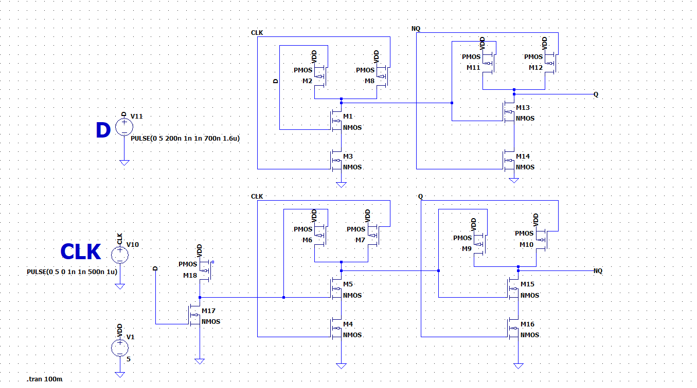

# CMOS D Latch - Transistor-Level Design

Transistor-level implementation and simulation of a D latch in LTspice, built entirely from NMOS/PMOS devices.

The circuit is assembled from four 2-input CMOS NAND gates plus one inverter (18 transistors total). Two NAND gates gate the data input with the clock; the remaining two are cross-coupled to form the storage loop.

## Circuit

| Block | Transistors | Function |
|---|---|---|
| Inverter (M17, M18) | 2 | Generates D |
| NAND1 (M1, M2, M3, M8) | 4 | Gates D with CLK |
| NAND2 (M4, M5, M6, M7) | 4 | Gates D with CLK |
| NAND3 (M11-M14) | 4 | Cross-coupled - outputs Q |
| NAND4 (M9, M10, M15, M16) | 4 | Cross-coupled - outputs NQ |

Each NAND uses two PMOS in parallel (pull-up) and two NMOS in series (pull-down).

## Results

| CLK | D | Q | Behaviour |
|---|---|---|---|
| 0 | X | held | Latch closed - Q keeps its previous value |
| 1 | 0 | 0 | Transparent - Q follows D |
| 1 | 1 | 1 | Transparent - Q follows D |

## Files
- `Dlatch.asc` - LTspice schematic
- `Dlatch.plt` - plot settings
- `images/schematic.png` - transistor-level schematic

## Simulation setup

- Supply: 5 V
- CLK: PULSE(0 5 0 1n 1n 500n 1u) - 1 MHz
- D: PULSE(0 5 200n 1n 1n 700n 1.6u) - asynchronous with CLK, so transitions occur while CLK is high
- Analysis: `.tran 5u`
